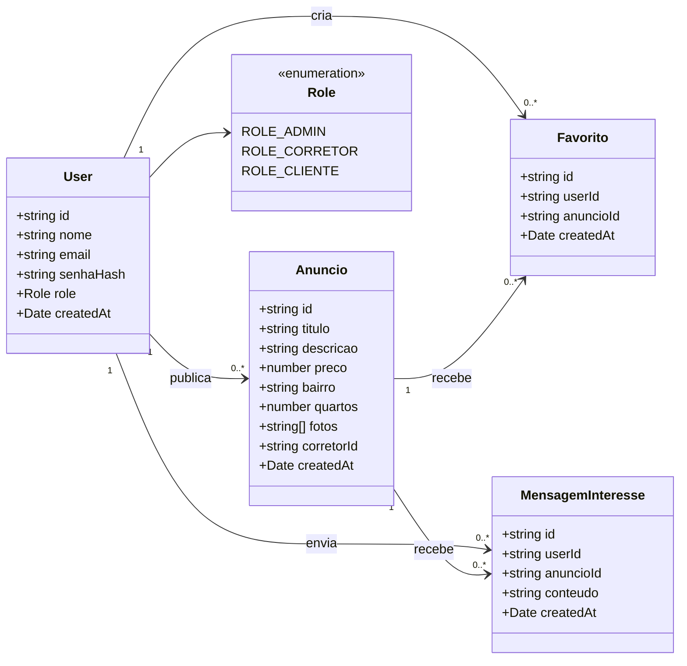

## Diagrama de Classes/ER - Portal Imobiliario

```mermaid
classDiagram
		direction LR

		class User {
			+string id
			+string nome
			+string email
			+string senhaHash
			+Role role
			+Date createdAt
		}

		class Anuncio {
			+string id
			+string titulo
			+string descricao
			+number preco
			+string bairro
			+number quartos
			+string[] fotos
			+string corretorId
			+Date createdAt
		}

		class Favorito {
			+string id
			+string userId
			+string anuncioId
			+Date createdAt
		}

		class MensagemInteresse {
			+string id
			+string userId
			+string anuncioId
			+string conteudo
			+Date createdAt
		}

		class Role {
			<<enumeration>>
			ROLE_ADMIN
			ROLE_CORRETOR
			ROLE_CLIENTE
		}

		User "1" --> "0..*" Anuncio : publica
		User "1" --> "0..*" Favorito : cria
		Anuncio "1" --> "0..*" Favorito : recebe
		User "1" --> "0..*" MensagemInteresse : envia
		Anuncio "1" --> "0..*" MensagemInteresse : recebe
		User --> Role
```

